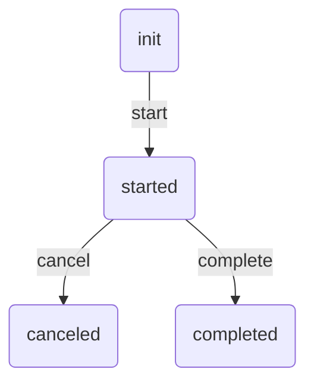

# workflow-go
This package provides instrumentation to manage a state machine

## Usage

Let's create the subject type
```go
type Subject struct {
    State string
}
```

And the state manager type with implementation of `github.com/creatortsv/waorkflow-go/pkg/workflow/state.Manager` interface
```go
package manager

import "context"

type Manager struct {
    // ...
}

func (m *Manager) State(_ context.Context, subject *Subject) (string, error) {
    return subject.State
}

func (m *Manager) Place(_ context.Context, subject *Subject, state string) error {
    subject.State = state

    return nil
} 
```

Now let's create our workflow service with some transitions, the subject and do switch state
```go
package main

import (
    "github.com/creatortsv/waorkflow-go/pkg/workflow"

    "github.com/my-vendor/workflow/example/interanal/domain/subject"
    "github.com/my-vendor/workflow/example/interanal/service/manager"
)

func main() {
    s := &subject.Subject{State: "init"}
    w := workflow.New(&manager.Manager{})

    w.WithTransition("start", "started", []string{"init"})
    w.Apply(context.Background(), s, "start")

    fmt.Printf("State: %s", s.State)
}
```

This prints
```shell
State: started
```

## Generate graph

```yaml
workflow:
    process:
        transitions:
            start:
                from: [ init ]
                to: started

            cancel:
                from: [ started ]
                to: canceled

            complete:
                from: [ started ]
                to: completed
```

This will generate `mermaid` graph

